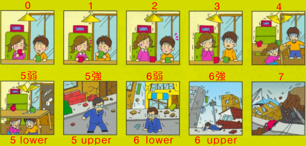
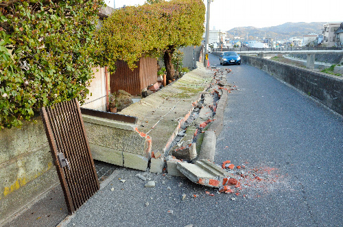
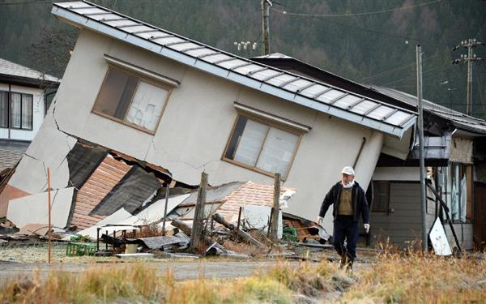
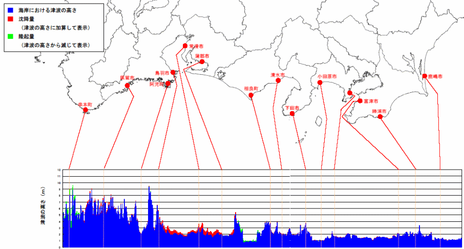
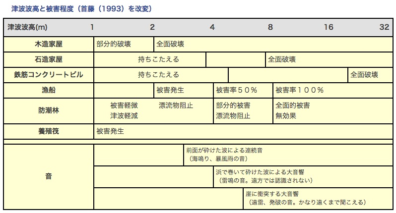
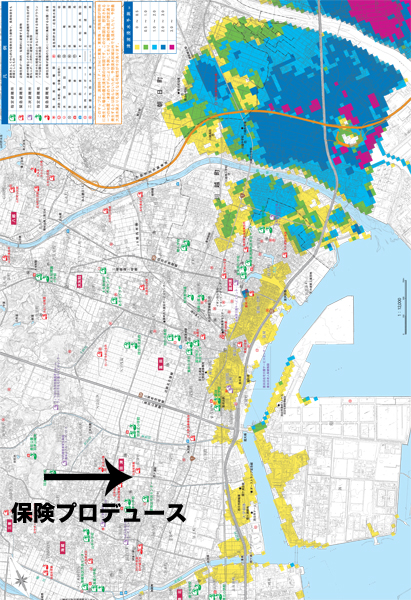
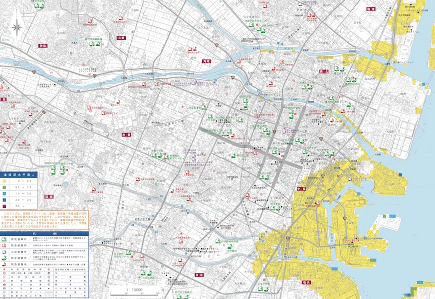
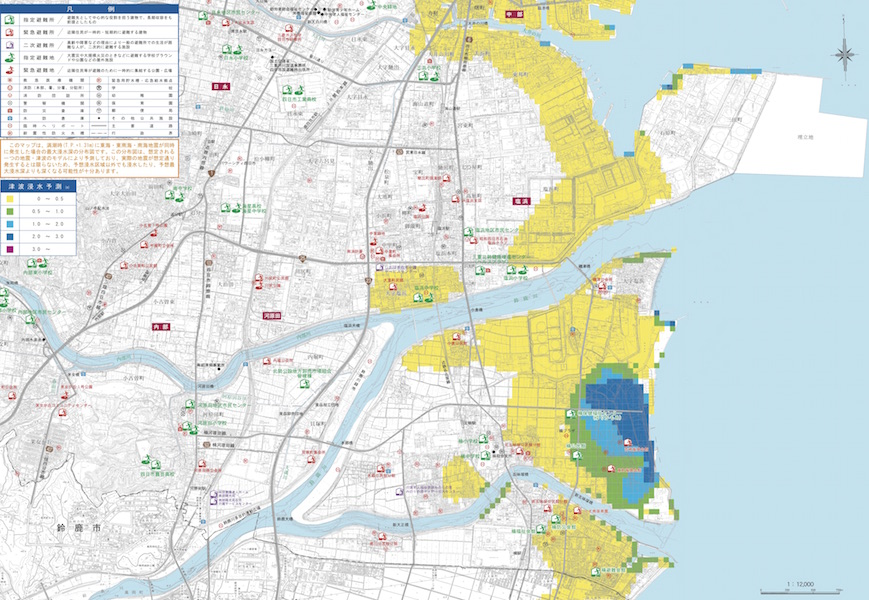
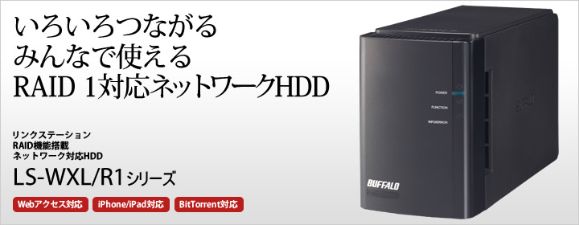
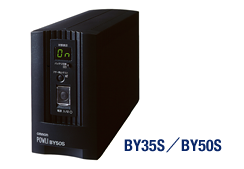

# 東南海地震に備えて

参考資料：

中央防災会議「南海トラフ巨大地震対策について」H25.5

---
## 起こる確率

### 30年以内の発生確率

|地震     |確率|
|--------|----|
|南海地震  |60%|
|東南海地震|70-80%|

---
## 地震の強さ

---
## 四日市の地震

震度6弱

---
## 震度図解

---
## 震度6弱

（淡路島）

---
## 震度5

軟弱地盤上の建物は震度7規模のダメージを受ける

（中越地震）

---
## 津波の高さ

---
## 津波の被害

---
## 津波の範囲

---
## 津波の範囲

---
## 津波の範囲

---
## 暫定まとめ

- 津波は基本的に来ない
- 地震は震度6弱
  - ただし、地盤が弱いと建物が倒壊する
- 救援物資は、四日市は高速で近畿とつながっているため、比較的早めに来るかも

---
## 第2回打ち合わせ

---
## データの現状

- 容量：500GB
- バックアップ：なし

---
## リスク

- 落下、衝撃
- 停電、瞬間停電
- 寿命

---
## 停電対策

- 無停電電源装置というものがある
- 2万5000円から

---
## バックアップの方法

1. 弁当箱の中にバックアップ
2. 遠隔地にバックアップ

---
## 弁当箱の中にバックアップ

実施すると・・・

- アクセスの速さは落ちる
- ハードディスクが2つ入っている
  - 片方が故障しても大丈夫