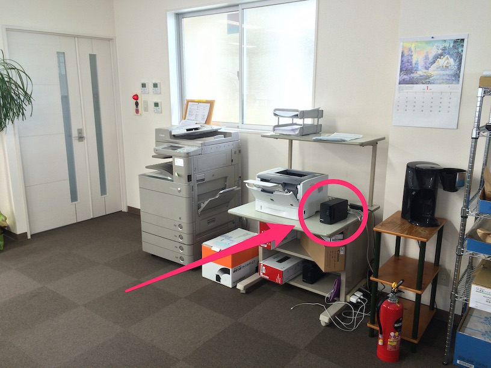
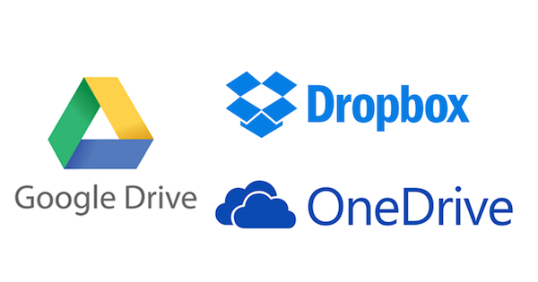

# 東南海地震に備えて

保険プロデュース防災チーム

植田達郎

---
## 第1回打ち合わせ

- 想定される被害
  - 参考資料：中央防災会議「南海トラフ巨大地震対策について」H25.5

---
## 起こる確率

### 30年以内の発生確率

|地震     |確率|
|--------|----|
|南海地震  |60%|
|東南海地震|70-80%|

---
## 地震の強さ

---
## 四日市の地震

震度6弱

---
## 震度図解

---
## 震度6弱

（淡路島）

---
## 震度5

軟弱地盤上の建物は震度7規模のダメージを受ける

（中越地震）

---
## 津波の高さ

---
## 津波の被害

---
## 津波の範囲

---
## 津波の範囲

---
## 津波の範囲

---
## 暫定まとめ

- 津波は基本的に来ない
- 地震は震度6弱
  - ただし、地盤が弱いと建物が倒壊する
- 救援物資は、四日市は高速で近畿とつながっているため、比較的早めに来るかも

---
## 第2回打ち合わせ

- データのリスクとバックアップ

---
## データの現状

通称「お弁当箱」

---
## 製品情報

- 容量：500GB
- ハードディスク2基搭載
- バックアップ：現状なし

---
## データのリスク

- リスク
  - 落下、衝撃
  - 停電、瞬間停電
  - 寿命
- 結果
  - いずれにせよ、ハードディスクは完全に使えなくなる。
  - 中のデータを復旧するには専門的なサービスが必要（10万円〜）。
  - 災害対応に使うことができない。

---
## リスク対応：停電

- 無停電電源装置というものがある
- 2万5000円〜
- 電気をためておいて、一時的に停電しても、給電する

---
## リスク対応：バックアップ

1. 弁当箱の中にバックアップ
2. 遠隔地にバックアップ

---
## リスク対応：弁当箱の中にバックアップ

実施すると・・・

- アクセスの速さは落ちる
- ハードディスクが2つ入っている
  - 片方が故障しても大丈夫

---
## やるべきか？

- 個人的には、実施した方が良いと考えます
  - アクセスの速さは遅くなるが、ほとんど変わらない
  - ハードディスクは信頼できない（これまで何回か自分のハードディスクが寿命で壊れた経験がある）

---
## リスク対応：遠隔地にバックアップ

- 容量：1TB（＝1000GB＝お弁当箱2つ分）
- 価格：1万円ぐらい／1年

---
## やるべきか？

- 結論：個人的には、実施した方が良いと考えます
- メリット
  - お弁当箱が壊れてもデータを復旧させることができる
  - 安心感
- その他のメリット
  - 誤ってファイルを消してしまっても、復元することが可能（安心感）
  - 外回り中にiPadやiPhoneでバックアップデータを閲覧できる（便利）

---
## デメリット
  - データをクラウド（社外）に保存することに対する不安（よくある話だが、個人的には「保存しない」ことの方がずっと不安）
  - 法的な問題[クラウドコンピューティングに関する法的問題点](http://www.risktaisaku.com/sys/series/?p=270)
    - 「個人情報保護法23条1項は、原則として、事前に本人の同意を得ることなく、個人情報を第三者に提供してはいけないと規定しています。」
    - 「もっとも個人情報保護法23条４項１号は、「利用目的の達成に必要な範囲内において個人データの取扱いの全部又は一部を委託する」場合は、本人の同意を得る必要はないと規定しており、クラウドサービス事業者に対し、個人情報の管理を委託することは、同条に該当すると考えられます。」
    - 「クラウドを導入することは、原則として個人情報保護法には違反しないと考えられます。なお、個人情報保護法により規定されている事業者は、5000人以上の個人情報をデータベース化している事業者に限られます。」
    - 

---
## サービスを選択する

- Googleは玄人向け
- MicrosoftはLinkStationを使うことができない
- 結論：Dropboxを選ぶ
  - 価格：1200円／月